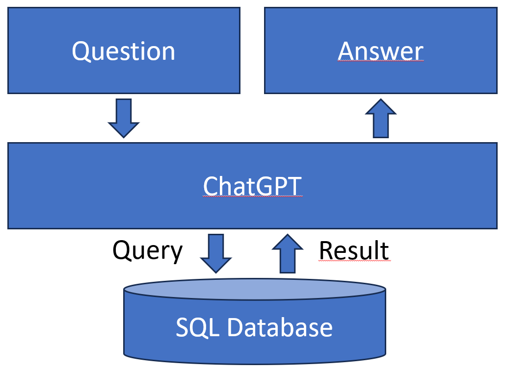

# SQL Augmented Generation (SAG)

This is a simple example project to experiment wit SQL Augmented Generations.

## Demo

A recoding of the service: [SAG service demo](Video/SAG%20service%20recording.mp4)

## What is SAG?

SAG is a way to use ChatGPT as an interface on top of a database. A question that is asked about the data is parsed by ChatGPT into a SQL query that can be executed on the database. After execution the query result is again passed through ChatGPT with the original question and an answer can be formulated for the user.

If you want to see how this works in code, look [here](SAGDemo/Services/SagServiceBase.cs).

# How to run

1) Add your OpenAI api token in [SAGDemo/appsettings.json](SagDemo/appsettings.json)
2) Create an SQL Database called `SAGDemo` (or change the connection string in [SAGDemo/appsettings.json](SagDemo/appsettings.json))
3) Run `SetupDatabase.sql`on the new database
4) Run the application
